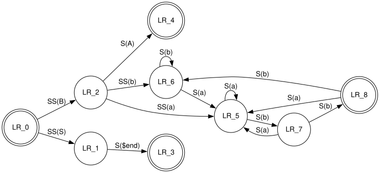

# Zig build for graphviz

Statically linked graphviz 14.0.0 with `dot` layout and the `plugin/core`
renderers. No dlopen, no plugin config, no external libraries.



Produced by `examples/fsm.zig`, which builds the
[gallery FSM](https://graphviz.org/Gallery/directed/fsm.html) through the Zig
API rather than parsing DOT.

## Upstream is not pinned yet

Zig's fetcher refuses graphviz's release tarball:

```
note: file 'redhat/graphviz.spec.rhel.in' has unsupported type '1'
```

`std.tar` rejects hard links. The release tarball is the only source shipping
the pre-generated parsers (`grammar.c`, `scan.c`, `htmlparse.c`), so a git
checkout would need bison, flex and python3.

Build against an extracted release tree instead. `nix develop` fetches one and
sets `GRAPHVIZ_SRC`, which is the default for `-Dupstream-path`, so `zig build`
needs no flags. Without nix:

```sh
curl -LO https://gitlab.com/api/v4/projects/graphviz%2Fgraphviz/packages/generic/graphviz-releases/14.0.0/graphviz-14.0.0.tar.xz
tar xf graphviz-14.0.0.tar.xz
zig build -Dupstream-path=graphviz-14.0.0
```

To pin later: `zig fetch --save=upstream <url>`, then set
`has_pinned_upstream = true` in `build.zig`.

## Usage

```zig
const gv = @import("graphviz");

const ctx = try gv.Context.init();
defer ctx.deinit();

const graph = try gv.Graph.parse("digraph { a -> b; }");
defer graph.deinit();

const svg = try ctx.renderGraphAlloc(allocator, graph, .dot, .svg);
defer allocator.free(svg);
```

Building a graph instead of parsing one. Attributes are struct literals, with
the field name as the attribute name and the value formatted by its type:

```zig
const graph = try gv.Graph.init("fsm", .directed);
defer graph.deinit();

try graph.set(.{ .rankdir = .LR });
try graph.nodeDefault(.{ .shape = .circle });

const a = try graph.nodeWith("LR_0", .{ .shape = .doublecircle, .width = 0.08 });
const b = try graph.nodeFmt("s{d}", .{1});
_ = try graph.edgeWith(a, b, .{ .label = "SS(B)", .constraint = false });
try b.setFmt("label", "{d}/{d}", .{ 1, 2 });
```

Enums and enum literals become their tag name, numbers and bools are printed,
and strings are used as they are. Anything else with a `format` method is
rendered with `{f}`, which is how `gv.escape` fits in:

```zig
try b.set(.{ .label = gv.escape("C:\\path") });
try b.setFmt("label", "{f}/{f}", .{ gv.escape(x), gv.escape(y) });
```

Subgraphs box nodes and pin ranks:

```zig
const box = try graph.cluster("chain");   // named cluster_chain, so dot draws a box
_ = try box.node("a");

const row = try graph.subgraph("same_0");
try row.set(.{ .rank = .same });
```

Formatted values go through a `gv.max_inline_bytes` stack buffer and return
`NameTooLong` or `ValueTooLong` rather than truncating. Strings that arrive
NUL terminated bypass it, so a long label is a `[:0]u8` you build yourself.

Raw declarations stay reachable as `gv.c` with the implementation linked in.
`@import("headers")` gives the declarations without it.

```sh
zig build run-example            # SVG
zig build run-example -- plain   # coordinates
```

## Design

* Plugins are compiled in. `ENABLE_LTDL` is undefined and `src/builtins.c`
  supplies the `lt_symlist_t` table, as upstream's `dot_builtins.cpp` does.
* `config.h` comes from `addConfigHeader`. Feature probes are target queries.
* One compile unit for all 128 upstream `.c` files, because `lib/common` and
  `lib/gvc` are mutually recursive and zig module imports form a DAG.
* Two C shims, both translate-c limits: the plugin table, and
  `gv_open_graph()`, since `agopen` takes a bitfield struct by value.

## Limitations

* Text metrics are estimated, not font exact, because there is no pango or
  cairo. Against upstream `dot` the gallery FSM matches in topology and
  ordering, with geometry within 3%.
* No bitmap output. No HTML-like labels (needs expat). `dot` layout only.
* `plugin/core` builds whole. Its symbol table references every renderer, so
  none can be dropped. The extras are dependency free.

## Licensing

This repository is MIT. It contains no graphviz source and ships no graphviz
binaries, you supply the extracted release tree yourself. Builds link
[graphviz](https://graphviz.org) 14.0.0 statically, which is
[EPL-1.0](https://www.eclipse.org/legal/epl-v10.html). See `COPYING` in the
release tarball and the [upstream notice](https://graphviz.org/license/).
